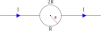

## Number 1

**Question:** Two wire threads are bent to form a semicircle with a radius of a as shown in the diagram. If the upper semicircle has a resistance of 2R Ω and the lower one has a resistance of R Ω, the magnetic field at the center of the circle is...

## Number 2

**Question:** An electric current flows along a high-voltage power line from the West to the East. The direction of the magnetic field caused by the current above that wire is towards the … .

South 

North

East

West

Southeast

## Number 3

**Question:** Two very long straight wires are placed parallel to each other at a distance r. Each wire carries a current I in opposite directions. Therefore, the two wires will...

Oppose each other with a force proportional to r.

Attract each other with a force proportional to \\(r^{−2}\\).

Oppose each other with a force proportional to \\(r^{−1}\\).

Attract each other with a force proportional to \\(r^{−1}\\).

Attract each other with a force proportional to \\(r^{2}\\).